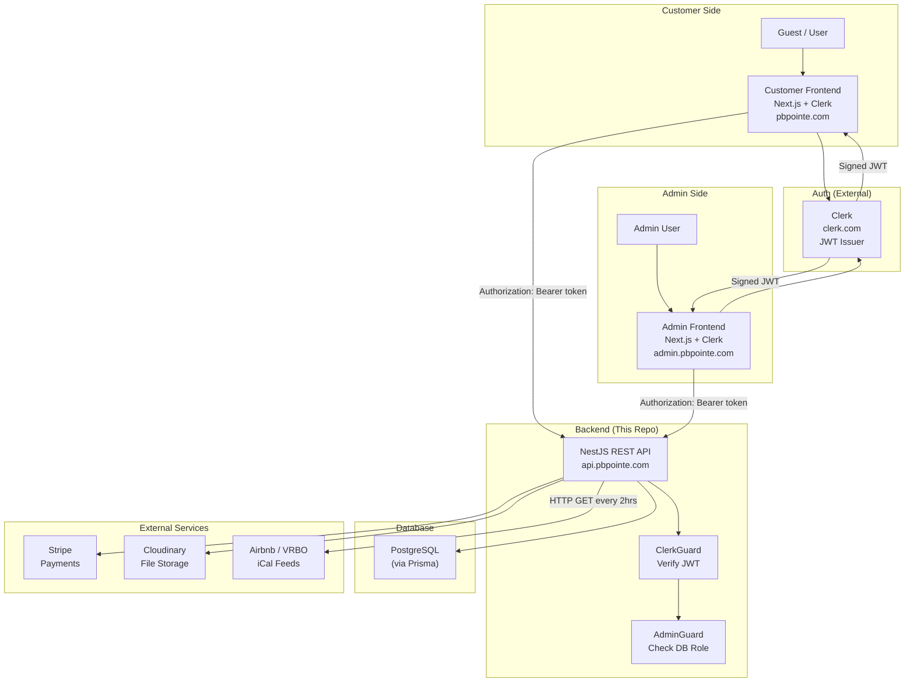
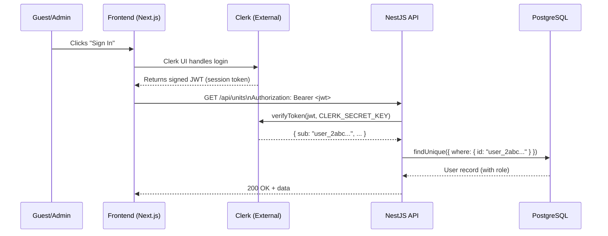

# 01 — System Architecture

## High-Level Overview

---

## JWT Flow — How Authentication Works

---

## Layer Explanations

### Layer 1 — Customer Frontend (pbpointe.com)
- Built with Next.js and Clerk's React components (`@clerk/nextjs`)
- Handles all UI: unit browsing, availability search, booking creation, Stripe redirect, review submission
- Never touches raw passwords or sessions — Clerk manages this entirely
- On every protected request, sends the Clerk JWT as `Authorization: Bearer <token>`

### Layer 2 — Admin Frontend (admin.pbpointe.com)
- Separate Next.js app, also using Clerk for login
- On load, calls `POST /api/auth/sync` to verify the user is in the DB with `role = ADMIN`
- If the backend returns 403, the frontend shows "Access Denied"
- Provides UI for: unit management, booking oversight, manual calendar blocking, gallery/testimonial management, refunds, dashboard stats

### Layer 3 — NestJS Backend (api.pbpointe.com)
The core of this repository. Responsibilities:
- Receive and verify Clerk JWTs via `ClerkGuard`
- Enforce role-based access via `AdminGuard` (checks PostgreSQL, not Clerk)
- Execute all business logic (availability checks, pricing, booking state machine, cancellation rules)
- Orchestrate external services (Stripe, Cloudinary, iCal)
- Run scheduled tasks (iCal sync every 2 hours)

### Layer 4 — PostgreSQL (via Prisma)
- Single source of truth for all application data
- Roles are stored here — Clerk knows nothing about GUEST/ADMIN roles
- `User.id` is the Clerk userId string (e.g. `user_2abc123`) — not a UUID
- `BlockedDate` table serves as the unified calendar — all sources (BOOKING, ICAL, MANUAL) write here

### Layer 5 — External Services

| Service | Purpose | Integration Point |
|---|---|---|
| **Clerk** | Authentication, user sessions, JWT issuance | `@clerk/backend` → `verifyToken()` in ClerkGuard |
| **Stripe** | Payment processing, refunds | `stripe` npm package; webhook at `POST /api/payments/webhook` |
| **Cloudinary** | Image hosting and CDN delivery | `cloudinary` npm package; used in Units and Gallery modules |
| **Airbnb/VRBO** | External calendar feeds (iCal format) | `node-ical` fetches and parses; cron runs every 2 hours |

---

## Design Decisions

### Why Clerk instead of custom auth?
Building auth from scratch (sessions, password hashing, email verification, OAuth) adds weeks of work and significant security risk. Clerk handles all of this as a managed service, letting the backend focus entirely on booking domain logic.

### Why separate AdminGuard from ClerkGuard?
Clerk only knows if a user is authenticated (valid session). It knows nothing about our application's GUEST/ADMIN distinction. Separating the two guards keeps concerns clean:
- `ClerkGuard` → "Is this a valid logged-in user?" (Clerk's job)
- `AdminGuard` → "Is this user an admin in OUR system?" (our DB's job)

### Why a unified BlockedDate table?
Rather than having separate "booked dates," "iCal blocked dates," and "manual blocked dates" tables, all blocked dates share one table with a `source` enum (`BOOKING | ICAL | MANUAL`). This makes the availability check trivially simple: query one table, get all blocked dates. The source field controls what admin operations are allowed on each row.

### Why raw body for Stripe webhook?
Stripe signs its webhook payloads. The signature is computed over the raw request body bytes. Once Express/NestJS parses the body into a JSON object, the raw bytes are lost and signature verification fails. The raw body middleware must be registered before any JSON body parsers.
