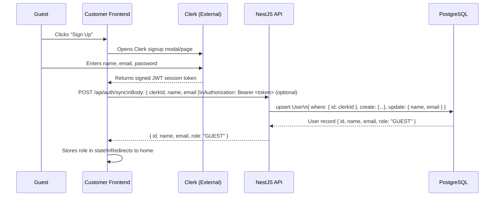
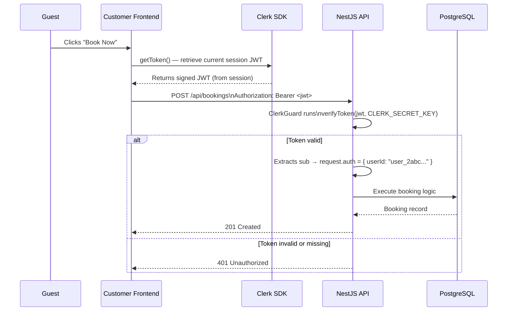
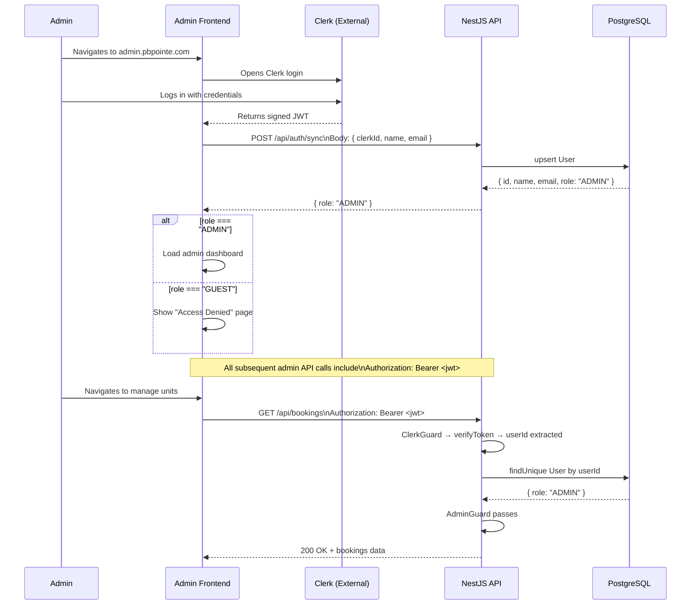

# 04 — Auth Flow

## Overview

Authentication is fully delegated to **Clerk**. The NestJS backend never issues tokens, stores passwords, or manages sessions. It only **verifies** Clerk-issued JWTs on incoming requests.

Roles (`GUEST` / `ADMIN`) are NOT managed by Clerk — they live in the PostgreSQL `User` table.

---

## Flow 1 — New User Signup



**Key points:**
- `/api/auth/sync` is public — no Clerk JWT required to call it (the user just signed up)
- It uses `upsert` so re-calling it (e.g. page refresh after signup) is idempotent
- The returned `role` tells the frontend whether to show "Visit admin portal" or the normal guest experience

---

## Flow 2 — Guest Making a Protected Request



---

## Flow 3 — Admin Login and Role Check



---

## ClerkGuard Implementation

```typescript
@Injectable()
export class ClerkGuard implements CanActivate {
  async canActivate(context: ExecutionContext): Promise<boolean> {
    const request = context.switchToHttp().getRequest();
    const token = request.headers.authorization?.replace('Bearer ', '');
    if (!token) throw new UnauthorizedException();
    const payload = await verifyToken(token, {
      secretKey: process.env.CLERK_SECRET_KEY,
    });
    request.auth = { userId: payload.sub }; // Clerk userId attached to request
    return true;
  }
}
```

- Runs on every route decorated with `@UseGuards(ClerkGuard)`
- On success, attaches `request.auth.userId` for downstream use
- `verifyToken` from `@clerk/backend` handles JWT signature verification, expiry, and issuer checks

---

## AdminGuard Implementation

```typescript
@Injectable()
export class AdminGuard implements CanActivate {
  constructor(private readonly prisma: PrismaService) {}

  async canActivate(context: ExecutionContext): Promise<boolean> {
    const request = context.switchToHttp().getRequest();
    const clerkUserId = request.auth?.userId;
    if (!clerkUserId) throw new UnauthorizedException();
    const user = await this.prisma.user.findUnique({ where: { id: clerkUserId } });
    if (!user || user.role !== 'ADMIN') throw new ForbiddenException();
    return true;
  }
}
```

- Always runs AFTER `ClerkGuard` (both applied on admin routes: `@UseGuards(ClerkGuard, AdminGuard)`)
- Looks up the user in PostgreSQL using the Clerk userId extracted by ClerkGuard
- Returns `403 Forbidden` if user exists but is not an ADMIN
- Returns `401 Unauthorized` if ClerkGuard didn't run first (safety check)

---

## Guard Usage on Routes

```typescript
// Public route — no guards
@Get('units')
findAll() { ... }

// Authenticated guest route
@UseGuards(ClerkGuard)
@Post('bookings')
createBooking() { ... }

// Admin-only route
@UseGuards(ClerkGuard, AdminGuard)
@Get('admin/stats')
getStats() { ... }
```

---

## Two-Frontend Strategy

| Frontend | Domain | Users | On load |
|---|---|---|---|
| Customer | pbpointe.com | Guests (+ admins who landed here) | Calls `/api/auth/sync` after signup; if role = ADMIN, shows "Visit admin portal" link |
| Admin | admin.pbpointe.com | Admins only | Calls `/api/auth/sync` on every load; if role ≠ ADMIN, redirects to Access Denied page |

Both frontends use the **same Clerk application** and the **same backend**. The differentiation is purely in the frontend's response to the `role` field returned from `/api/auth/sync`.

---

## Admin Role Assignment

Clerk does NOT manage roles. There is **no API endpoint** to self-promote to admin.

To make a user admin after they have signed up:

```sql
UPDATE "User" SET role = 'ADMIN' WHERE email = 'admin@pbpointe.com';
```

Or via a one-time Prisma script:

```typescript
await prisma.user.update({
  where: { email: 'admin@pbpointe.com' },
  data: { role: 'ADMIN' },
});
```
