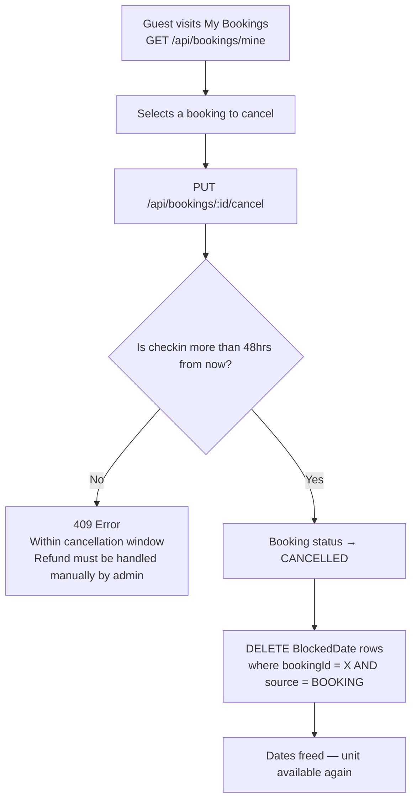

# 05 — Booking Flow

## End-to-End Booking Flowchart

```mermaid
flowchart TD
    A([Guest visits pbpointe.com]) --> B[Browse units\nGET /api/units]
    B --> C[Select a unit\nGET /api/units/:slug]
    C --> D[Choose check-in & check-out dates]
    D --> E[GET /api/availability/:unitId\n?checkin=&checkout=]
    E --> F{Available?}
    F -- No --> G[Show blocked dates\nAsk to pick different dates]
    G --> D
    F -- Yes --> H[Show price summary\nnights × rate + cleaning + 12% service fee]
    H --> I[Guest clicks Confirm & Pay]
    I --> J{Is guest logged in?\nClerk session exists?}
    J -- No --> K[Redirect to Clerk login/signup]
    K --> L[After login, return to booking page]
    L --> I
    J -- Yes --> M[POST /api/bookings\n{ unitId, checkin, checkout, guests }]
    M --> N{Availability re-checked\natomically in DB}
    N -- Conflict found --> O[409 Conflict\nDates taken — pick new dates]
    O --> D
    N -- Clear --> P[Booking created\nstatus = PENDING]
    P --> Q[POST /api/payments/session\n{ bookingId, successUrl, cancelUrl }]
    Q --> R[Stripe Checkout Session created\nGuest redirected to Stripe-hosted page]
    R --> S{Guest action on Stripe}
    S -- Pays --> T[Stripe fires webhook\ncheckout.session.completed]
    S -- Abandons --> U[Booking stays PENDING\nExpires / admin can clean up]
    T --> V[Backend verifies Stripe signature]
    V --> W[Booking status → CONFIRMED\nPayment status → PAID]
    W --> X[BlockedDates written\none row per night, source = BOOKING]
    X --> Y[Guest redirected to successUrl\nConfirmation page shown]
    S -- Card declines --> Z[Stripe fires payment_intent.payment_failed\nPayment status → FAILED\nBooking stays PENDING]
```

---

## Step-by-Step Detail

### Step 1 — Browse & Select
- `GET /api/units` with optional filters (`?type=&guests=&checkin=&checkout=`) returns all available units
- If checkin/checkout filters are provided, backend excludes units with conflicts in BlockedDate
- Guest selects a unit and is taken to the unit detail page

### Step 2 — Date Selection & Availability Check
- Guest picks dates using a date picker on the unit page
- Frontend calls `GET /api/availability/:unitId?checkin=YYYY-MM-DD&checkout=YYYY-MM-DD`
- Backend queries `BlockedDate` for all rows where `unitId = X AND date >= checkin AND date < checkout`
- If any rows exist → `{ available: false, blockedDates: [...] }`
- If no rows → `{ available: true, priceSummary: { ... } }`
- Blocked dates are highlighted on the calendar; guest must pick different dates

### Step 3 — Price Display
Response from availability check includes a `priceSummary`:
```
nights      = (checkout - checkin) in days
basePrice   = nights × pricePerNight
cleaningFee = unit.cleaningFee
serviceFee  = Math.round(nights × pricePerNight × 0.12)
totalPrice  = basePrice + cleaningFee + serviceFee
```

### Step 4 — Login Gate
- If guest is not logged in, clicking "Confirm & Pay" opens the Clerk login/signup modal
- After successful login, Clerk returns to the same booking page with the session active
- No dates or selections are lost (stored in URL params or local state)

### Step 5 — Create Booking (PENDING)
- Frontend calls `POST /api/bookings` with the Clerk JWT in the Authorization header
- **ClerkGuard** verifies the JWT and attaches `userId` to the request
- **BookingsService** re-checks availability atomically (race condition protection):
  - If a conflict now exists → `409 Conflict`
  - If clear → creates `Booking` record with `status = PENDING`
- `totalPrice` is computed server-side (not trusted from client) using the formula above
- Response returns the booking ID for use in the next step

### Step 6 — Stripe Checkout Session
- Frontend immediately calls `POST /api/payments/session` with the bookingId
- Backend creates a Stripe Checkout Session:
  - Line item: unit name, total price (in cents), quantity 1
  - `metadata.bookingId` stored on the session for webhook lookup
  - `success_url` and `cancel_url` from request body
- Response returns `{ sessionId, url }` — frontend redirects the guest to Stripe's hosted checkout page

### Step 7 — Payment & Webhook
See [06-payment-flow.md](06-payment-flow.md) for the full webhook handling detail.

On success:
- Booking status → `CONFIRMED`
- Payment status → `PAID`
- One `BlockedDate` row written per night in the range, `source = BOOKING`, `bookingId` populated

### Step 8 — Cancellation Flow



**Cancellation rules:**
- Only the booking owner can cancel (ClerkGuard extracts userId, service verifies booking.userId matches)
- Only allowed if `booking.checkin > now + 48 hours`
- Only `BOOKING`-sourced `BlockedDate` rows for that `bookingId` are removed
- `ICAL` and `MANUAL` rows are never touched by cancellation
- If within 48 hours, guest must contact the property — admin handles refund manually via the admin panel
