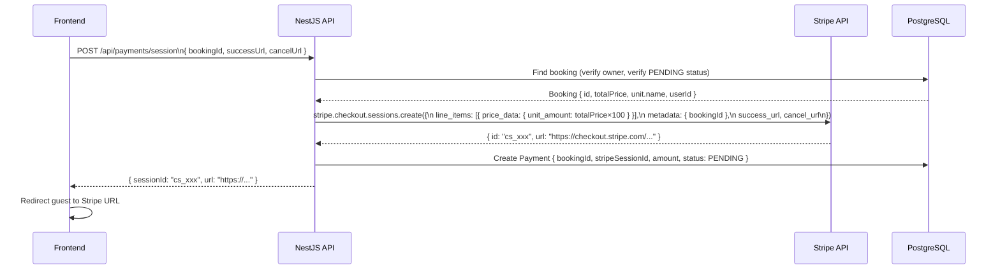
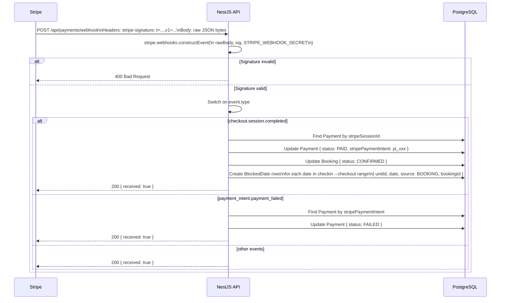
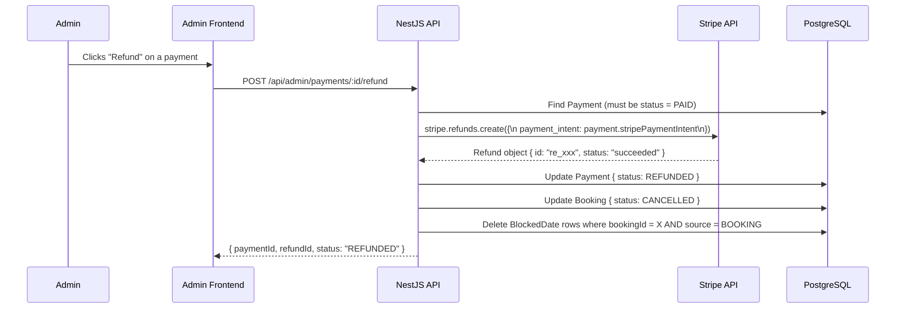

# 06 — Payment Flow

## Overview

Payments are processed entirely through **Stripe Checkout**. The backend never handles card details — Stripe hosts the payment page. The backend creates a Checkout Session, redirects the guest to Stripe, and then receives a signed webhook event from Stripe to confirm the result.

---

## Stripe Checkout Session Creation



**Guards:** `ClerkGuard` — user must be logged in; service verifies they own the booking.

**Price is always computed server-side** and stored on the Booking record. The frontend never sends the price.

---

## Webhook — Payment Confirmed



### Raw Body Requirement

```typescript
// In main.ts — MUST come before any body parsers
app.use('/api/payments/webhook', express.raw({ type: 'application/json' }));

// In app.module or main.ts — global JSON parser for all other routes
app.use(express.json());
```

Stripe computes its `stripe-signature` HMAC over the raw request bytes. Once a JSON body parser converts the body to a JavaScript object, the raw bytes are gone and `constructEvent` will throw `400`. The raw body middleware must be registered **first**, scoped to the webhook path only.

---

## BlockedDate Writing on Confirmation

When `checkout.session.completed` fires, the service expands the booking's date range into individual calendar days and upserts each one:

```typescript
// Pseudocode — actual implementation in PaymentsService
const dates = eachDayOfInterval({ start: booking.checkin, end: subDays(booking.checkout, 1) });

for (const date of dates) {
  await prisma.blockedDate.upsert({
    where: { unitId_date: { unitId: booking.unitId, date } },
    create: { unitId: booking.unitId, date, source: 'BOOKING', bookingId: booking.id },
    update: {},  // never overwrite existing rows (could be ICAL or MANUAL)
  });
}
```

`checkout` date is NOT blocked — it is the departure day, not a night the guest occupies.

---

## Admin Refund Flow



**On refund:**
- Payment record → `REFUNDED`
- Booking record → `CANCELLED`
- All `BOOKING`-sourced `BlockedDate` rows for that `bookingId` are deleted
- Dates become available again for new bookings
- `ICAL` and `MANUAL` blocked dates are never touched

---

## Error Cases

| Scenario | HTTP Code | Handling |
|---|---|---|
| `constructEvent` fails (bad signature) | 400 | Throw immediately, log, return 400 |
| Booking not found in webhook | 404 | Log warning, return 200 (Stripe doesn't retry 200s) |
| Payment already PAID (duplicate webhook) | — | Upsert is idempotent; no harm |
| Payment not PAID on refund attempt | 409 | Return 409 Conflict |
| Stripe refund API error | 500 | Log, rethrow — admin retries manually |
