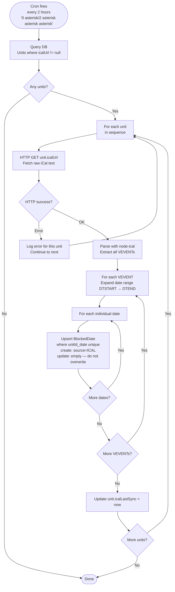
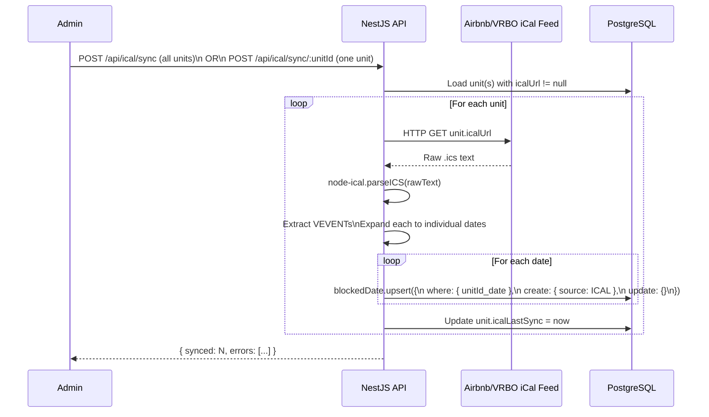

# 07 — iCal Sync Flow

## Purpose

Each of the 17 units may have an Airbnb or VRBO listing with its own iCal calendar feed URL. When a guest books through Airbnb or VRBO, those dates must be blocked in this system to prevent double bookings. The iCal sync job fetches each unit's feed every 2 hours and writes the blocked dates into the shared `BlockedDate` table with `source = ICAL`.

---

## iCal URL Storage

Each `Unit` record has an optional `icalUrl` field:

```prisma
model Unit {
  ...
  icalUrl      String?    // e.g. https://www.airbnb.com/calendar/ical/XXXXX.ics
  icalLastSync DateTime?  // updated after each successful sync
}
```

Admin sets this via `PUT /api/units/:id/ical` from the admin frontend. Units without an `icalUrl` are skipped during sync.

---

## Automated Sync — Cron Job



**Cron expression:** `'0 */2 * * *'` — runs at minute 0 of every 2nd hour (00:00, 02:00, 04:00, etc.)

---

## Manual Sync (Admin-Triggered)



---

## Upsert Logic — Why `update: {}`

```typescript
await prisma.blockedDate.upsert({
  where: { unitId_date: { unitId, date } },
  create: { unitId, date, source: BlockSource.ICAL },
  update: {},  // intentionally empty
});
```

The `@@unique([unitId, date])` constraint means a unit can only have one `BlockedDate` per day. The upsert uses this as the conflict key.

- `update: {}` (empty) — if a row already exists for that date, do nothing. This prevents an ICAL sync from overwriting a `BOOKING`-sourced row (from a direct booking confirmed via Stripe) or a `MANUAL`-sourced row (admin block). The existing row is preserved exactly as-is.
- `create` — if no row exists for that date, create a new one with `source = ICAL`

This means: **direct bookings always win**. If a guest books through the website first, that date is `BOOKING`-sourced and a subsequent iCal sync will not overwrite it. The availability check treats all sources equally anyway, so the practical effect is the same — the date stays blocked.

---

## iCal Parsing Detail

```typescript
import * as ical from 'node-ical';
import { eachDayOfInterval, parseISO, subDays } from 'date-fns';

const raw = await fetch(unit.icalUrl).then(r => r.text());
const parsed = ical.parseICS(raw);

for (const event of Object.values(parsed)) {
  if (event.type !== 'VEVENT') continue;

  const start = new Date(event.start);
  const end = subDays(new Date(event.end), 1); // end date is exclusive in iCal

  const dates = eachDayOfInterval({ start, end });
  for (const date of dates) {
    // upsert each date into BlockedDate
  }
}
```

**Important:** iCal `DTEND` is exclusive (checkout day, not an occupied night). We subtract 1 day so we only block actual occupied nights, matching our booking convention.

---

## Availability Check — All Sources Treated Equally

```typescript
// In AvailabilityService
const blocked = await prisma.blockedDate.findMany({
  where: {
    unitId,
    date: {
      gte: checkin,
      lt:  checkout,  // checkout day is not blocked
    },
  },
});

return { available: blocked.length === 0, blockedDates: blocked.map(b => b.date) };
```

The availability check makes **no distinction between BOOKING, ICAL, and MANUAL sources**. If any row exists in `BlockedDate` for the unit in the requested range, the unit is unavailable. This is intentional — all blocked dates, regardless of origin, prevent new bookings.

---

## GET /api/ical/status Response

Admin can check sync health at any time:

```typescript
Array<{
  unitId:           string
  unitName:         string
  icalUrl:          string | null
  icalLastSync:     string | null   // ISO datetime of last successful sync
  icalBlockedCount: number          // count of ICAL-sourced BlockedDate rows for this unit
}>
```

Units without an `icalUrl` appear in this response with `icalUrl: null` and `icalLastSync: null`.
