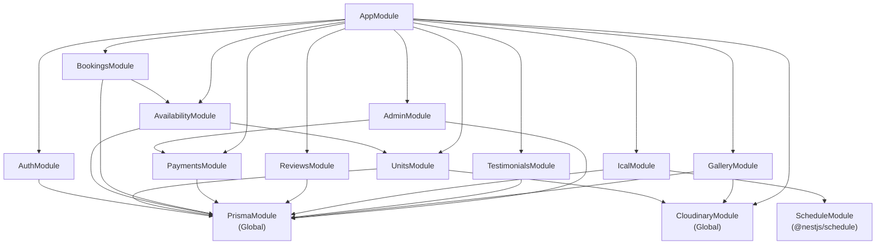

# 09 — Folder Structure

## Full Annotated Tree

```
pbpointe-backend/
│
├── prisma/
│   ├── schema.prisma              # Full DB schema — all models, enums, relations
│   └── seed.ts                    # Seeds all 17 units; no users (users created via /api/auth/sync)
│
├── src/
│   │
│   ├── main.ts                    # Bootstrap: CORS, ValidationPipe, raw body for Stripe, global prefix 'api'
│   ├── app.module.ts              # Root module — imports all feature modules + ScheduleModule
│   │
│   ├── prisma/
│   │   └── prisma.service.ts      # PrismaClient wrapper; global module imported by all feature modules
│   │
│   ├── auth/
│   │   ├── auth.module.ts         # Imports PrismaModule; exports guards for use by other modules
│   │   ├── auth.controller.ts     # Single endpoint: POST /api/auth/sync
│   │   ├── auth.service.ts        # upsert() — creates or updates User in DB from Clerk data
│   │   ├── dto/
│   │   │   └── sync-user.dto.ts   # { clerkId: string, name: string, email: string }
│   │   └── guards/
│   │       ├── clerk.guard.ts     # Verifies Clerk JWT from Authorization header; attaches userId to req.auth
│   │       └── admin.guard.ts     # Reads role from PostgreSQL User table; throws 403 if not ADMIN
│   │
│   ├── units/
│   │   ├── units.module.ts        # Imports PrismaModule, CloudinaryModule; exports UnitsService
│   │   ├── units.controller.ts    # GET/POST/PUT/DELETE /api/units + image and ical sub-routes
│   │   ├── units.service.ts       # Business logic: slug generation, active-booking guard on delete
│   │   ├── units.repository.ts    # Prisma queries for units (findAll with filters, findBySlug, CRUD)
│   │   └── dto/
│   │       ├── create-unit.dto.ts # All fields for creating a unit
│   │       └── update-unit.dto.ts # PartialType(CreateUnitDto) — all fields optional
│   │
│   ├── availability/
│   │   ├── availability.module.ts # Imports PrismaModule, UnitsModule
│   │   ├── availability.controller.ts  # GET /api/availability/:unitId
│   │   └── availability.service.ts     # Date range conflict check against BlockedDate; price summary
│   │
│   ├── bookings/
│   │   ├── bookings.module.ts     # Imports PrismaModule, AvailabilityModule
│   │   ├── bookings.controller.ts # POST/GET/PUT /api/bookings — guest + admin routes
│   │   ├── bookings.service.ts    # Atomic availability check, totalPrice compute, 48hr cancel rule
│   │   ├── bookings.repository.ts # Prisma queries (findMany with filters/pagination, findById)
│   │   └── dto/
│   │       └── create-booking.dto.ts   # { unitId, checkin, checkout, guests }
│   │
│   ├── payments/
│   │   ├── payments.module.ts     # Imports PrismaModule; configures Stripe client
│   │   ├── payments.controller.ts # POST /api/payments/session + POST /api/payments/webhook (raw body)
│   │   ├── payments.service.ts    # Stripe session creation, webhook event handling, BlockedDate writes
│   │   └── dto/
│   │       └── create-session.dto.ts   # { bookingId, successUrl, cancelUrl }
│   │
│   ├── reviews/
│   │   ├── reviews.module.ts      # Imports PrismaModule
│   │   ├── reviews.controller.ts  # GET /api/reviews/:unitId + POST + DELETE /api/reviews/:id
│   │   ├── reviews.service.ts     # Eligibility check (COMPLETED booking, reviewed=false), create, delete
│   │   ├── reviews.repository.ts  # Prisma queries for reviews
│   │   └── dto/
│   │       └── create-review.dto.ts    # { unitId, bookingId, rating, content }
│   │
│   ├── ical/
│   │   ├── ical.module.ts         # Imports PrismaModule, ScheduleModule
│   │   ├── ical.service.ts        # HTTP fetch, node-ical parse, upsert BlockedDates, update icalLastSync
│   │   ├── ical.scheduler.ts      # @Cron('0 */2 * * *') — calls IcalService.syncAllUnits()
│   │   └── ical.controller.ts     # POST /api/ical/sync, POST /api/ical/sync/:unitId, GET /api/ical/status
│   │
│   ├── cloudinary/
│   │   ├── cloudinary.module.ts   # Global module; configures Cloudinary with env credentials
│   │   └── cloudinary.service.ts  # uploadFile(buffer, folder), deleteFile(publicId)
│   │
│   ├── testimonials/
│   │   ├── testimonials.module.ts # Imports PrismaModule
│   │   ├── testimonials.controller.ts  # GET /api/testimonials + admin CRUD routes
│   │   ├── testimonials.service.ts     # Merge manual Testimonials + featured Reviews for public list
│   │   └── dto/
│   │       └── create-testimonial.dto.ts  # { guestName, location?, content, rating?, imageUrl?, order? }
│   │
│   ├── gallery/
│   │   ├── gallery.module.ts      # Imports PrismaModule, CloudinaryModule
│   │   ├── gallery.controller.ts  # GET /api/gallery + admin upload/edit/delete routes
│   │   ├── gallery.service.ts     # Cloudinary upload, save to DB, delete from both
│   │   └── dto/
│   │       └── create-gallery-image.dto.ts  # { caption?, unitId?, order? } + file upload
│   │
│   └── admin/
│       ├── admin.module.ts        # Imports PrismaModule, PaymentsModule; exports AdminService
│       ├── admin.controller.ts    # All /api/admin/* routes (stats, users, calendar, block, payments, checkins)
│       └── admin.service.ts       # Dashboard stats aggregation, user management, manual block/unblock, refund
│
├── .env                           # Secret values — never committed to git
├── .env.example                   # Template with all required variable names (no secrets)
├── .gitignore                     # Includes .env, node_modules, dist
├── nest-cli.json                  # NestJS CLI config
├── package.json                   # Dependencies and scripts
├── tsconfig.json                  # TypeScript compiler config
└── tsconfig.build.json            # TS config for production build (excludes test files)
```

---

## Module Dependency Map



---

## Naming Conventions

| Pattern | Example |
|---|---|
| Module files | `bookings.module.ts` |
| Controller files | `bookings.controller.ts` |
| Service files | `bookings.service.ts` |
| Repository files | `bookings.repository.ts` (only where query volume justifies separation) |
| DTO files | `create-booking.dto.ts`, `update-unit.dto.ts` |
| Guard files | `clerk.guard.ts`, `admin.guard.ts` |
| Class names | `BookingsService`, `ClerkGuard`, `CreateBookingDto` |
| Enum values | `SCREAMING_SNAKE_CASE` — matches Prisma schema |

## Notes on Repository Pattern

Not every module uses a repository file. Repositories are added only where the number of distinct Prisma queries justifies the separation from service logic:
- `units.repository.ts` — findAll with dynamic filters, findBySlug, findById
- `bookings.repository.ts` — paginated admin list, user's own list, findById with relations
- `reviews.repository.ts` — findByUnit with user join, findEligible
